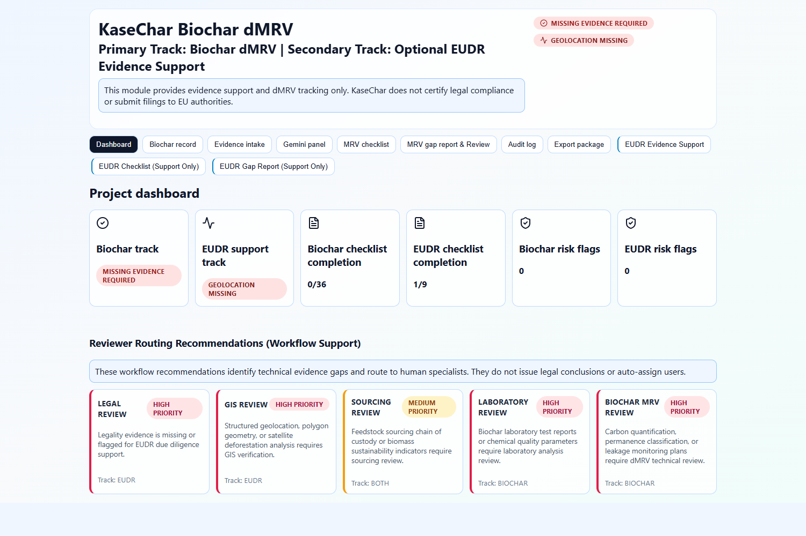
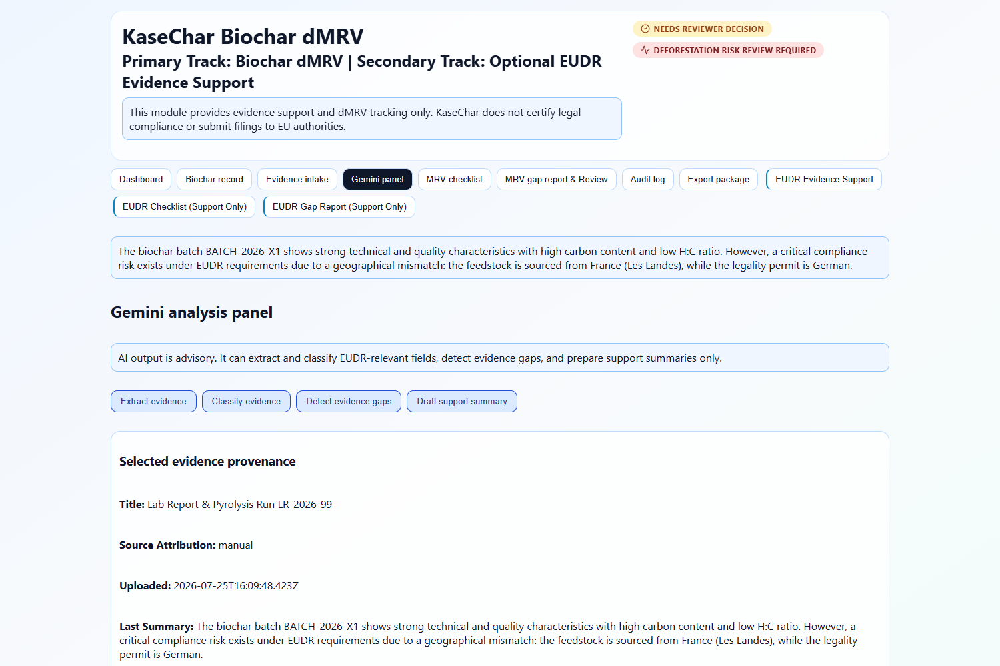
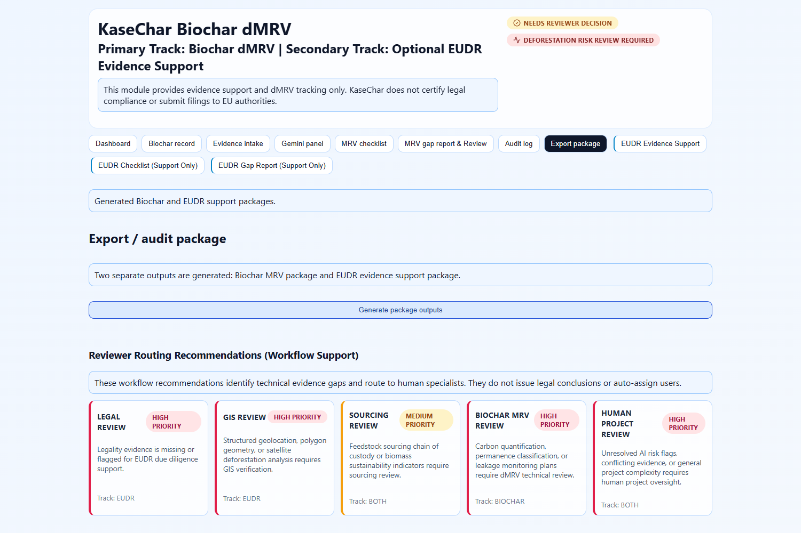

# KaseChar Product Evidence

KaseChar is an evidence-controlled biochar dMRV workspace. It supports source-grounded project review, server-owned monitoring evidence, deterministic gap reporting, and advisory AI-assisted extraction without representing certification, credit issuance, or verified removals.

## Product media

Existing repository-tracked submission media:

## Demonstrated workflow

1. Open the source-grounded Sonnenerde PyroDry monitoring workspace.
2. Inspect plan requirements, evidence gaps, provenance, and package-gating reasons.
3. Submit a USER_ASSERTION; it remains advisory and cannot satisfy material evidence coverage.
4. Admit the explicitly labelled controlled demo laboratory record; coverage changes only for that item and the package remains blocked.
5. Inspect the server-generated timeline and reset the controlled demo state.

## Verification record

See [VALIDATION.md](VALIDATION.md) for command, server, desktop-browser, Gemini, security-boundary, and production-demo-gate results.

See [MOBILE_QA_STATUS.md](MOBILE_QA_STATUS.md) for the explicit mobile-QA limitation. It is not represented as a completed browser verification.